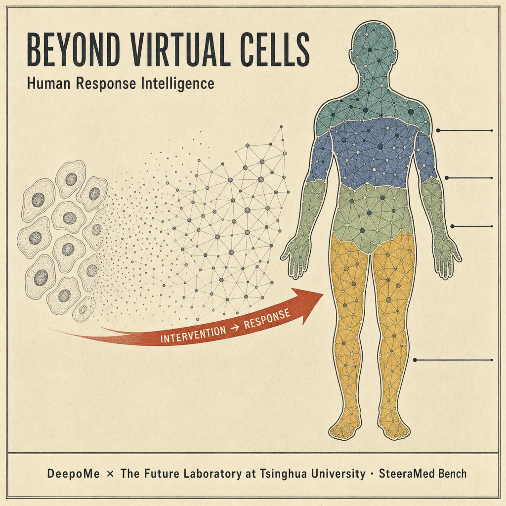
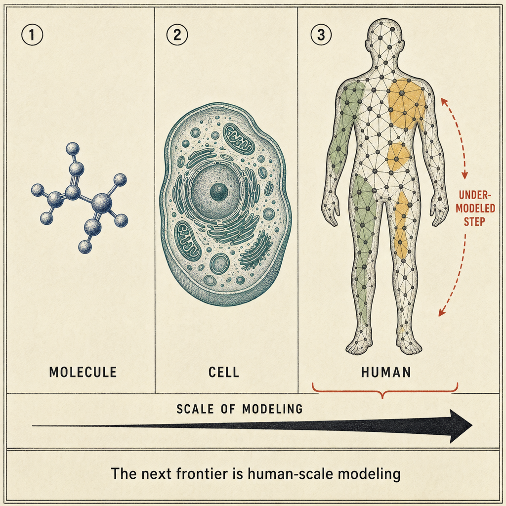
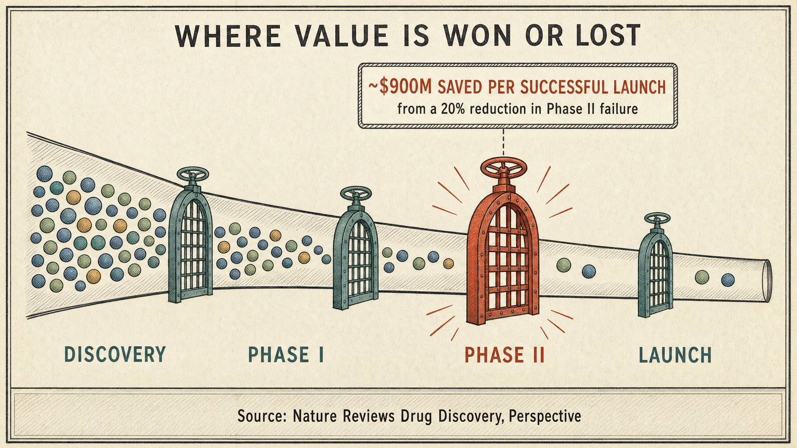

# SteeraMed-bench

> Building human-scale representations for **virtual patients** — a module-panel
> evaluation benchmark that uses drug repurposing as its human-scale testbed
> (332 modules, 1,916 drugs, five knowledge families).

[](https://steeramed.com)
[](https://steeramed.com/bench)
[](https://doi.org/10.20944/preprints202608.0998.v1)
[](LICENSE)

## From virtual cells to virtual patients

Virtual patients need a useful coordinate system before they can model
patient-specific dynamics. Virtual-cell programs are building the molecular
and cellular scales; treatment decisions, however, are made across a
**whole person** and across different forms of intervention. SteeraMed Bench
is a pioneering step toward that missing human scale: it uses **drug
repurposing as a human-scale testbed** for a central virtual-patient
question — *can a structured representation of biological directions
organize intervention-relevant knowledge well enough to prioritize known
drug–disease relationships?*

<p align="center">
  
</p>

**Beyond virtual cells — modeling the human response to intervention.**
AI is already strong at modeling proteins, generating molecules and
simulating cellular perturbations. The central opportunity is now shifting:
not only molecules or cells, but **how a whole person responds to
intervention**. Virtual patients are the goal — and a useful coordinate
system of biological directions is the prerequisite. *(AI-generated
concept illustration)*

<p align="center">
  
</p>

**The scale ladder — molecular, cellular, human.**
Each rung answers a different question: molecular models predict
interactions, cellular models predict perturbation responses, and
human-scale models must reason about which biological states matter,
which patients may respond, and what evidence should guide the next
intervention decision. SteeraMed Bench is a first, measurable step on
the third rung. *(AI-generated concept illustration)*

<p align="center">
  
</p>

**Drug development is gated at the human scale.**
Drug-development value is won or lost at the clinical gate: a *Nature
Reviews Drug Discovery* perspective estimates that cutting Phase II
failure by 20% can save nearly **$900 million** per successful drug
launch. Drug repurposing compresses this human-scale question into a
computable benchmark — if a representation of biological directions
cannot prioritize known drug–disease relationships, it is unlikely to
support harder intervention decisions. That is the gatekeeper role
repurposing plays here. *(AI-generated concept illustration)*

## What is SteeraMed?

**SteeraMed Bench** is a framework for **evaluating module panels** built
from a **332-module atlas**, developed by [DeepoMe](https://deepome.com).
The atlas combines extended aging hallmarks, traditional Chinese medicine
syndrome proxies, nutraceutical targets, and food-as-medicine targets.
It scores **1,916 drugs** against every module using the Guney
network-proximity metric on the STRING v12 interactome, then asks one
question: *which module panels best recover the approved drugs for each
disease?*

Across five chronic disease tasks, the full atlas reaches **Recall@20 =
0.524**, and the nutraceutical panel including extensions (**NUT+NUTX,
117 modules**) reaches **0.494** — both far above the column-permutation
null (0.017–0.032 in the paper's Table 1; 0.01–0.07 across panels in
this package's reproduction). No single panel wins everywhere: the atlas
works as a **panel-selection system**, exposing which biological
organization is most useful for each disease — hallmarks for type 2
diabetes and osteoporosis, food-as-medicine for depression, nutraceutical
modules for atherosclerosis/hyperlipidemia. As the paper reports, these
standard-CV numbers are within-benchmark estimates: performance decreases
under target-family-separated evaluation and approaches chance under
leave-one-disease-out evaluation.

**SteeraMed-bench** (this package) is the reproducibility companion: a
dependency-light Python package plus pre-computed data that reproduces
the paper's Table 1 panel results (via the predefined panels and the
custom-module entry point) and lets you evaluate **your own module
panels** under the exact same protocol. You can also explore the atlas
and try panel evaluation directly in the browser:
**<https://steeramed.com/bench>**

<p align="center">
  
</p>

*The framework as a whole (paper, Figure 1): curated module sources are
assembled into a 332-axis module library; an LLM-assisted workflow
proposes and revises candidate gene sets, scored for incremental
benchmark value and redundancy; the benchmark then evaluates predefined
panels and candidate modules against drug-repurposing tasks. Five
chronic diseases are the primary case studies; 23 disease categories
provide the exploratory extension.*

## The 332-module atlas

The benchmark is organized around five module families — four knowledge
paradigms in the paper (nutraceutical and its extensions count as one) —
covering complementary angles of aging biology and interventions:

| Family | Modules | What it captures |
|--------|---------|------------------|
| `Hallmarks:` | 72 | Aging-hallmark modules in five tiers (`A1`–`A5`) |
| `TCM:` | 38 | Traditional-Chinese-Medicine modules in three tiers (`T1`–`T3`) |
| `NUT:` | 80 | Nutrient / dietary-supplement modules — vitamins, minerals, amino acids, cofactors and botanicals (e.g. `NUT:Thiamine`, `NUT:Ginseng`) |
| `NUTX:` | 37 | Extended nutraceutical modules (e.g. `NUTX:Betaine`) |
| `FAM` | 105 | Food-as-medicine (FAM) herb modules — one per herb (e.g. clove, Chinese yam); module names carry a `YFY:` prefix in the released data files |

Every module ships as a **name + pre-computed z-score profile**, so the
full atlas can be redistributed and evaluated without disclosing any gene
list (see the policy section below).

## Module-definition policy (minimal definition)

The gene-set definitions of all 332 modules (aging hallmarks, TCM, nutrient
and functional-aging modules) are **proprietary and intentionally not
distributed** with this benchmark.  The release contains only:

- the aggregated **1916 drugs × 332 modules network-proximity z-score matrix**,
- positive drug labels for the five benchmark diseases,
- module-to-panel mapping and family/gene-count metadata.

This is sufficient to reproduce every panel result in Table 1 exactly, while
keeping how each module is built (its gene list) confidential.  The custom
evaluation entry point therefore operates on **module names**, not gene
symbols.

---

## Installation

Install directly from GitHub (not yet on PyPI):

```bash
pip install git+https://github.com/DeepoMe/SteeraMed-bench.git
```

For development:

```bash
git clone https://github.com/DeepoMe/SteeraMed-bench.git
cd SteeraMed-bench
pip install -e ".[dev]"
```

> **Data files are required** before evaluation. See
> [Data](#data) below.

---

## Quick Start

```python
from steeramed_bench import Bench

bench = Bench()                              # load pre-computed matrices
res = bench.evaluate_panel("ALL")            # reproduce Table 1
print(res.recall_at_20)                      # 0.524
```

Evaluate a custom module panel against a disease:

```python
bench.list_modules("NUT")[:5]                # pick modules by family
out = bench.evaluate_custom_modules(
    ["NUT:Thiamine", "Hallmarks:A1_telomere"],   # any names from list_modules()
    disease="T2D",
)
print(out.recall_at_20)
```

List what is available:

```python
bench.list_panels()     # 16 panels: tiers A1-A5/T1-T3, families, combinations, ALL
bench.list_diseases()   # 5 benchmark diseases with positive drug labels
bench.list_modules()    # 332 module names (no gene lists)
```

---

## Data

The package depends on **four pre-computed artefacts** that are distributed
separately (they are not bundled with the source and are not committed to
git):

| File | Description | Approx. size |
|------|-------------|--------------|
| `zscore_matrix.npz` | 1916 drugs × 332 modules network-proximity z-scores | ~5 MB |
| `disease_labels.csv` | Positive (approved) drug labels per disease | < 1 MB |
| `panel_mapping.csv` | Module → panel assignment | < 1 MB |
| `module_metadata.csv` | Module family, panel, gene **count** (no gene lists) | < 1 MB |

Download them from the
[latest GitHub Release](https://github.com/DeepoMe/SteeraMed-bench/releases)
and place the files in `steeramed_bench/data/` (or pass `data_dir=` to
`Bench`). Detailed instructions live in [`data/README_DATA.md`](data/README_DATA.md).

**What is *not* included**:

- Module gene-set definitions — proprietary; only z-scores and metadata are
  redistributed (see the policy section above).
- DrugBank raw XML — obtain your own license from <https://go.drugbank.com/>.
- STRING PPI network (~400 MB) — download from <https://string-db.org/>.
- repoDB — <https://apps.chiragjpgroup.org/repoDB/>.

The pre-computed z-scores are derived from these sources but redistributed
in aggregated form only.

---

## Panels

| Panel | # modules | Description |
|-------|-----------|-------------|
| `A1`–`A5` | 14/36/10/6/6 | Aging hallmark tier sub-panels |
| `T1`–`T3` | 7/13/18 | TCM tier sub-panels |
| `HALLMARKS` | 72 | Aging hallmark modules (tiers A1–A5) |
| `TCM` | 38 | Traditional Chinese Medicine modules |
| `NUT` | 80 | Nutrient modules |
| `NUTX` | 37 | Extended nutraceutical modules |
| `FAM` | 105 | Food-as-medicine herb modules (Chinese food-therapy herbs, one per herb) |
| `HALLMARKS_TCM` | 110 | Hallmarks + TCM combination |
| `TCM_NUT` | 118 | TCM + nutrient combination |
| `ALL` | 332 | Full module atlas |

Reference Recall@20 values (averaged over 5 diseases; paper Table 1 rows
shown for comparison — note the paper's nutraceutical row is the combined
**NUT+NUTX (117)** panel, evaluated here via the custom-module entry point):

```
Panel            Recall@20    Paper Table 1
HALLMARKS          0.433         0.433
TCM                0.324         0.324
NUT (80)           0.494           —
NUT+NUTX (117)       —           0.494
FAM                0.403           —
ALL                0.524         0.524
```

Across the paper's 23 exploratory disease categories, no single panel
dominates — the atlas works as a **panel-selection system** (paper,
Figure 2a):

<p align="center">
  
</p>

*Recall@20 for 23 disease categories × 5 panels (paper, Figure 2a).
Hallmarks lead in cancer and osteoporosis, nutraceuticals in analgesic /
antipsychotic / cardiovascular categories, food-as-medicine in
depression, TCM in sedative and antiepileptic categories. Per-category
winners are exploratory; the primary benchmark remains the five
chronic-disease case studies.*

The panel-evaluation protocol follows the paper (Table 1): stratified
5-fold cross-validated logistic regression (`C=0.1`, seeds 42/123/456)
produces out-of-fold drug scores, and Recall@20 uses the capped
denominator `min(20, n_positives)`. The permutation-null runs use this
package's own column-permutation implementation (see the null note in the
intro), so null values may differ slightly from the paper's Table 1.

---

## Examples

| Script | What it does |
|--------|--------------|
| `examples/01_reproduce_table1.py` | Reproduce Table 1 panel Recall@20 |
| `examples/02_custom_module.py` | Evaluate a custom module panel end-to-end |

```bash
python examples/01_reproduce_table1.py
```

---

## Relationship to the paper

This package is the reproducibility companion to:

> Xiong, J.; Xia, Q. [*Toward a Self-Learning AI Agent for Drug Repurposing:
> Building Human-Scale Representations for Virtual Patients*](https://www.preprints.org/manuscript/202608.0998).
> Preprints, 2026.
> DOI: [10.20944/preprints202608.0998.v1](https://doi.org/10.20944/preprints202608.0998.v1)

<p align="center">
  
</p>
<details><summary><sub>Concept illustration: the closed learning loop the paper works toward (AI-generated, not a paper figure)</sub></details>

In the paper, SteeraMed Bench is the evaluation framework that tests
whether module panels — human-scale biological directions drawn from four
knowledge paradigms — can prioritize known drug–disease relationships,
laying the coordinate foundation for virtual patients and future
self-learning agents.

This package implements the **panel evaluation** and **custom
module-panel** workflows of that framework. The LLM-assisted agent loop
for proposing new modules, the module gene-set definitions, the
23-disease-category extension, and the full STRING-proximity
re-computation are out of scope for this release; see the paper for
details.

---

## Links

| Resource | URL |
|----------|-----|
| Website | <https://steeramed.com> |
| Live benchmark demo | <https://steeramed.com/bench> |
| Paper | [Read the paper](https://www.preprints.org/manuscript/202608.0998) ([DOI](https://doi.org/10.20944/preprints202608.0998.v1)) |
| Data downloads | [GitHub Releases](https://github.com/DeepoMe/SteeraMed-bench/releases) |
| DeepoMe | <https://deepome.com> |

---

## License

[MIT](LICENSE) © 2026 DeepoMe

---

## 中文文档 / Chinese README

[阅读简体中文版 README](README_zh.md) · [English README](README.md)
