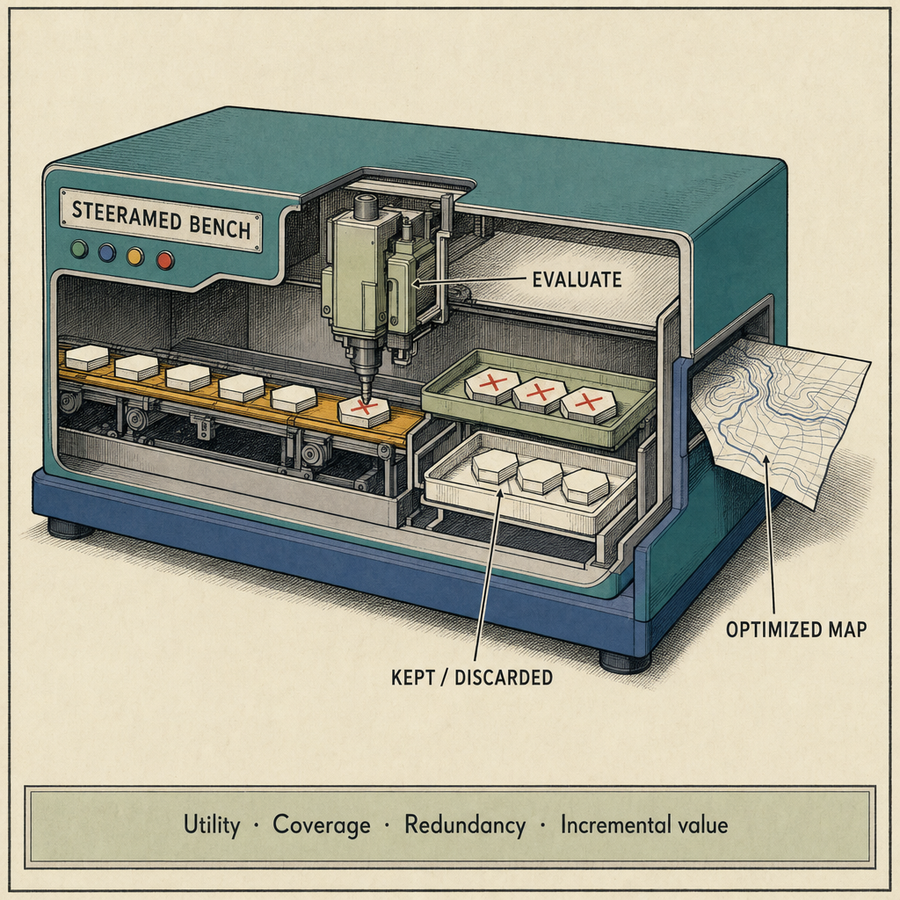
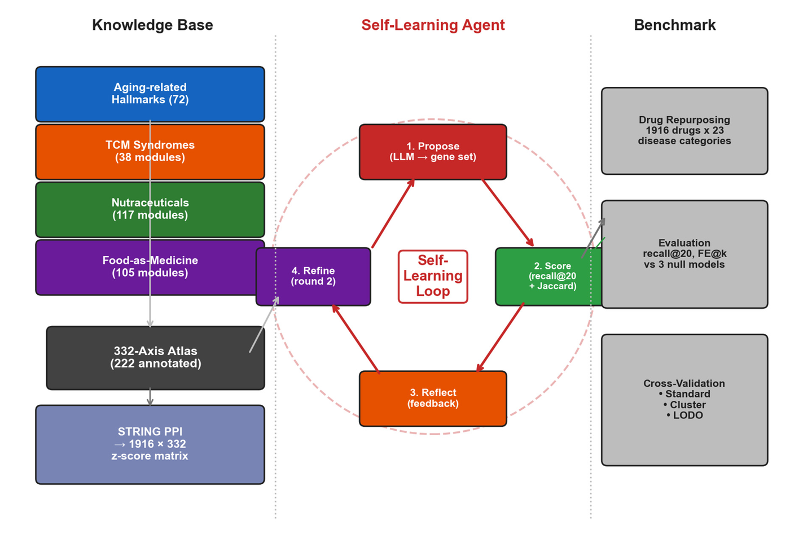
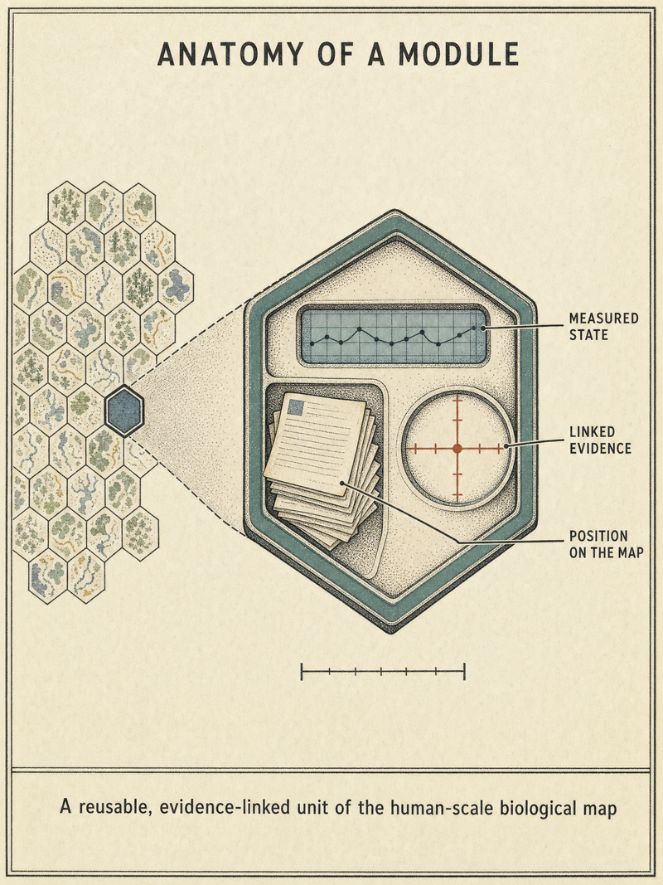
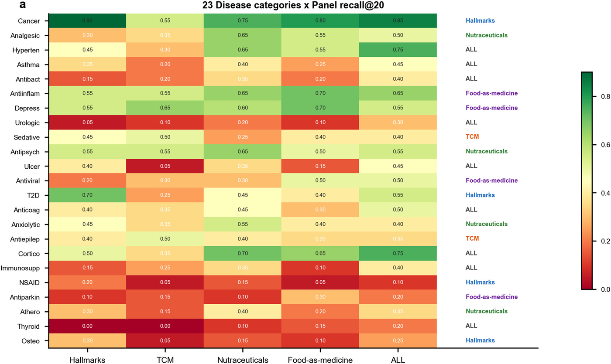
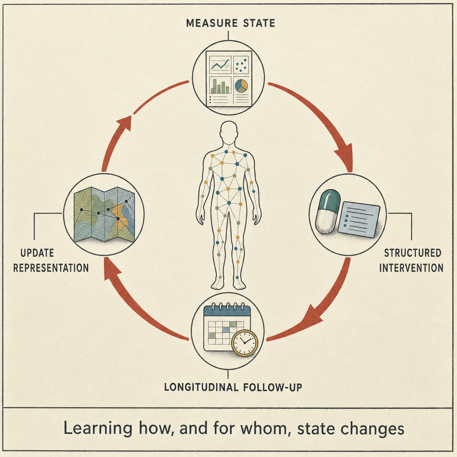

# SteeraMed-bench

> 面向药物重定位的模块面板评测基准（module-panel evaluation benchmark）——为虚拟病人构建"人类尺度"的生物学表征。

[](https://steeramed.com)
[](https://steeramed.com/bench)
[](https://doi.org/10.20944/preprints202608.0998.v1)
[](LICENSE)

[English](README.md) | 简体中文

<p align="center">
  
</p>
<details><summary><sub>概念插画（AI 生成，非论文插图）</sub></details>

## 什么是 SteeraMed？

**SteeraMed Bench** 是一个**模块面板评测框架**，由
[DeepoMe](https://deepome.com) 开发，基于一个 **332 模块图谱**构建。
该图谱整合了扩展衰老标志物（aging hallmarks）、传统中医证候代理模块、
营养素靶点与"药食同源"靶点。框架用 Guney 网络邻近度度量（基于 STRING
v12 互作组）为 **1,916 个药物**对每个模块打分，然后回答一个问题：
*哪些模块面板能最好地恢复各疾病已获批的药物？*

在五个慢性疾病任务上，完整图谱达到 **Recall@20 = 0.524**，含扩展的
营养素面板（**NUT+NUTX，117 模块**）达到 **0.494**——两者均远高于
列置换零分布（论文 Table 1 报告 0.017–0.032；本包复现为 0.01–0.07）。
没有任何单一面板在所有疾病上占优：图谱本身是一个**面板选择系统**，
揭示对每种疾病最有用的生物学组织方式——2 型糖尿病与骨质疏松偏向
Hallmarks，抑郁偏向药食同源，动脉粥样硬化/高脂血症偏向营养素模块。
如论文所述，这些标准交叉验证数字是基准内估计：在 target-family
分离评估下性能下降，在留一疾病（leave-one-disease-out）评估下接近
随机水平。

**SteeraMed-bench**（本包）是可复现性配套：一个轻依赖的 Python 包，
附带预计算数据，可复现论文 Table 1 的面板结果（通过预定义面板与
自定义模块入口），并允许你在**完全相同的协议**下评测**你自己的模块
面板**。你也可以直接在浏览器中探索图谱并试用面板评测：
**<https://steeramed.com/bench>**

<p align="center">
  
</p>

*框架全景（论文 Figure 1）：精选模块来源组装为 332 轴模块库；
LLM 辅助工作流提出并修订候选基因集，按增量基准价值与冗余度打分；
基准随后针对药物重定位任务评测预定义面板与候选模块。五个慢性疾病
为主要案例研究；23 个疾病类别提供探索性扩展。*

## 332 模块图谱

基准围绕五个模块家族组织——论文中的四个知识范式（营养素与其扩展
计为一个）——覆盖衰老生物学与干预的互补视角：

| 家族 | 模块数 | 捕获内容 |
|------|--------|----------|
| `Hallmarks:` | 72 | 五个层级的衰老标志物模块（`A1`–`A5`） |
| `TCM:` | 38 | 三个层级的传统中医模块（`T1`–`T3`） |
| `NUT:` | 80 | 营养素/膳食补充剂模块——维生素、矿物质、氨基酸、辅因子与植物提取物（如 `NUT:Thiamine`、`NUT:Ginseng`） |
| `NUTX:` | 37 | 扩展营养素模块（如 `NUTX:Betaine`） |
| `YFY:` | 105 | 药食同源中药模块——每味药材一个模块（如 `YFY:丁香`、`YFY:山药`） |

每个模块仅以**名称 + 预计算 z 分数谱**形式发布，因此完整图谱可以在
不披露任何基因列表的情况下被分发与评测（见下文政策节）。

<p align="center">
  
</p>
<details><summary><sub>概念插画：模块的解剖（AI 生成，非论文插图）</sub></details>

## 模块定义政策（最小定义）

全部 332 个模块（衰老标志物、TCM、营养素与功能衰老模块）的基因集
定义**为专有内容，有意不随基准分发**。发布内容仅包含：

- 聚合后的 **1916 药物 × 332 模块网络邻近度 z 分数矩阵**，
- 五个基准疾病的阳性药物标签，
- 模块到面板的映射及家族/基因数元数据。

这足以精确复现 Table 1 的全部面板结果，同时保持每个模块的构建方式
（其基因列表）保密。因此自定义评测入口基于**模块名称**操作，而非
基因符号。

---

## 安装

直接从 GitHub 安装（尚未上架 PyPI）：

```bash
pip install git+https://github.com/DeepoMe/SteeraMed-bench.git
```

开发安装：

```bash
git clone https://github.com/DeepoMe/SteeraMed-bench.git
cd SteeraMed-bench
pip install -e ".[dev]"
```

> **评测前必须准备数据文件**。见下方[数据](#数据)节。

---

## 快速上手

```python
from steeramed_bench import Bench

bench = Bench()                              # 加载预计算矩阵
res = bench.evaluate_panel("ALL")            # 复现 Table 1
print(res.recall_at_20)                      # 0.524
```

针对某个疾病评测自定义模块面板：

```python
bench.list_modules("NUT")[:5]                # 按家族挑选模块
out = bench.evaluate_custom_modules(
    ["NUT:Thiamine", "Hallmarks:A1_telomere"],   # list_modules() 中的任意名称
    disease="T2D",
)
print(out.recall_at_20)
```

查看可用内容：

```python
bench.list_panels()     # 16 个面板：A1-A5/T1-T3 层级、家族、组合、ALL
bench.list_diseases()   # 5 个基准疾病及阳性药物标签
bench.list_modules()    # 332 个模块名（无基因列表）
```

---

## 数据

本包依赖**四个预计算产物**，它们单独分发（不随源码打包、不进入 git）：

| 文件 | 说明 | 大约体积 |
|------|------|----------|
| `zscore_matrix.npz` | 1916 药物 × 332 模块网络邻近度 z 分数 | ~5 MB |
| `disease_labels.csv` | 各疾病阳性（已获批）药物标签 | < 1 MB |
| `panel_mapping.csv` | 模块 → 面板分配 | < 1 MB |
| `module_metadata.csv` | 模块家族、面板、基因**数量**（无基因列表） | < 1 MB |

从
[最新 GitHub Release](https://github.com/DeepoMe/SteeraMed-bench/releases)
下载，放入 `steeramed_bench/data/`（或向 `Bench` 传 `data_dir=`）。
详细说明见 [`data/README_DATA.md`](data/README_DATA.md)。

**不包含的内容**：

- 模块基因集定义——专有；仅分发 z 分数与元数据（见上文政策节）。
- DrugBank 原始 XML——请自行从 <https://go.drugbank.com/> 获取许可。
- STRING PPI 网络（~400 MB）——从 <https://string-db.org/> 下载。
- repoDB——<https://apps.chiragjpgroup.org/repoDB/>。

预计算 z 分数源自上述来源，但仅以聚合形式再分发。

---

## 面板

| 面板 | 模块数 | 说明 |
|------|--------|------|
| `A1`–`A5` | 14/36/10/6/6 | 衰老标志物层级子面板 |
| `T1`–`T3` | 7/13/18 | TCM 层级子面板 |
| `HALLMARKS` | 72 | 衰老标志物模块（层级 A1–A5） |
| `TCM` | 38 | 传统中医模块 |
| `NUT` | 80 | 营养素模块 |
| `NUTX` | 37 | 扩展营养素模块 |
| `FAM` | 105 | 药食同源（FAM）中药模块——每味药材一个模块 |
| `HALLMARKS_TCM` | 110 | Hallmarks + TCM 组合 |
| `TCM_NUT` | 118 | TCM + 营养素组合 |
| `ALL` | 332 | 完整模块图谱 |

参考 Recall@20 值（5 疾病平均；并列给出论文 Table 1——注意论文的
营养素行是合并的 **NUT+NUTX (117)** 面板，在本包中经自定义模块入口
评测）：

```
面板              Recall@20    论文 Table 1
HALLMARKS          0.433         0.433
TCM                0.324         0.324
NUT (80)           0.494           —
NUT+NUTX (117)       —           0.494
FAM                0.403           —
ALL                0.524         0.524
```

在论文的 23 个探索性疾病类别上，没有单一面板全面占优——图谱作为
**面板选择系统**工作（论文 Figure 2a）：

<p align="center">
  
</p>

*23 疾病类别 × 5 面板的 Recall@20（论文 Figure 2a）。Hallmarks 在
癌症与骨质疏松领先，营养素在镇痛/抗精神病/心血管类别领先，药食同源
在抑郁领先，TCM 在镇静与抗癫痫类别领先。各类别优胜者属探索性结论；
主要基准仍为五个慢性疾病案例研究。*

面板评测协议遵循论文（Table 1）：分层 5 折交叉验证逻辑回归
（`C=0.1`，种子 42/123/456）产生 out-of-fold 药物分数，Recall@20
使用截断分母 `min(20, n_positives)`。置换零分布使用本包自带的列置
换实现（见引言中的 null 说明），因此零值可能与论文 Table 1 略有
差异。

---

## 示例

| 脚本 | 功能 |
|------|------|
| `examples/01_reproduce_table1.py` | 复现 Table 1 面板 Recall@20 |
| `examples/02_custom_module.py` | 端到端评测自定义模块面板 |

```bash
python examples/01_reproduce_table1.py
```

---

## 与论文的关系

本包是以下论文的可复现性配套：

> Xiong, J.; Xia, Q. [*Toward a Self-Learning AI Agent for Drug Repurposing:
> Building Human-Scale Representations for Virtual Patients*](https://www.preprints.org/manuscript/202608.0998).
> Preprints, 2026.
> DOI: [10.20944/preprints202608.0998.v1](https://doi.org/10.20944/preprints202608.0998.v1)

<p align="center">
  
</p>
<details><summary><sub>概念插画：论文所展望的闭环学习（AI 生成，非论文插图）</sub></details>

在论文中，SteeraMed Bench 是检验"模块面板——来自四个知识范式的人类
尺度生物学方向——能否优先排序已知药物-疾病关系"的评测框架，为虚拟
病人与未来自学习智能体奠定坐标基础。

本包实现该框架的**面板评测**与**自定义模块面板**工作流。LLM 辅助
的新模块提议闭环、模块基因集定义、23 疾病类别扩展以及完整 STRING
邻近度重计算不在本发布范围内；详见论文。

---

## 相关链接

| 资源 | URL |
|------|-----|
| 网站 | <https://steeramed.com> |
| 在线基准演示 | <https://steeramed.com/bench> |
| 论文 | [阅读论文](https://www.preprints.org/manuscript/202608.0998)（[DOI](https://doi.org/10.20944/preprints202608.0998.v1)） |
| 数据下载 | [GitHub Releases](https://github.com/DeepoMe/SteeraMed-bench/releases) |
| DeepoMe | <https://deepome.com> |

---

## 许可证

[MIT](LICENSE) © 2026 DeepoMe

---

## 文档语言 / Languages

[English README](README.md) | [阅读简体中文版 README](README_zh.md)
